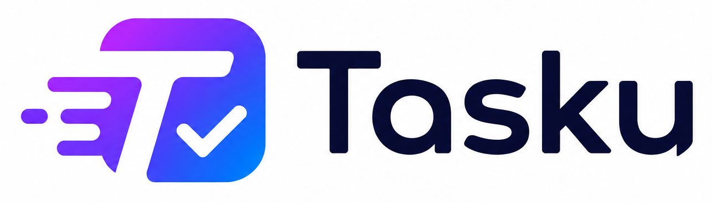
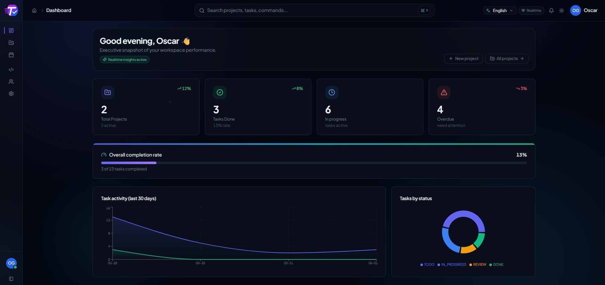
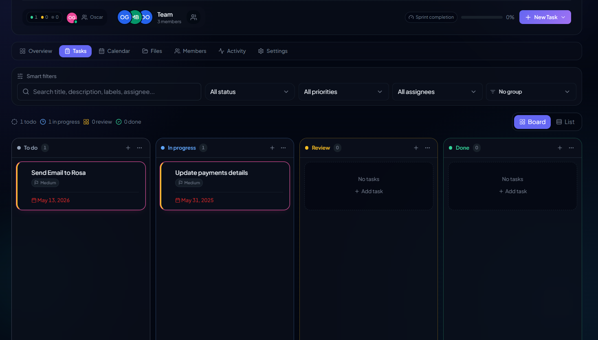
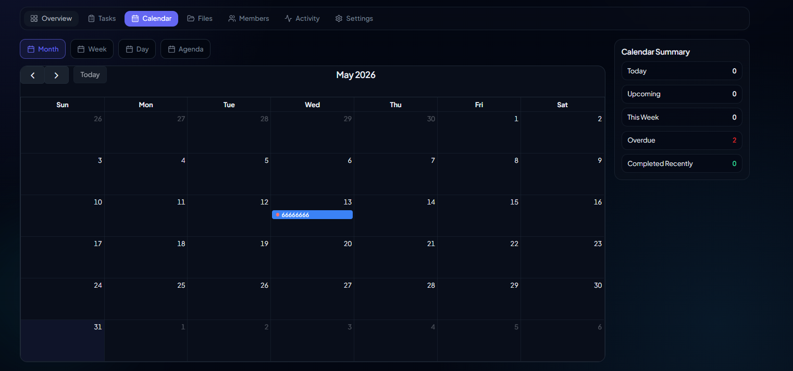
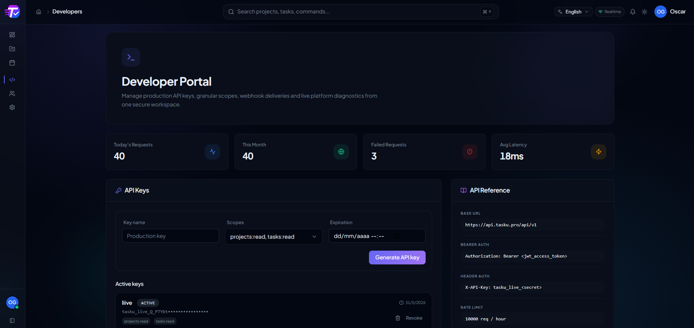
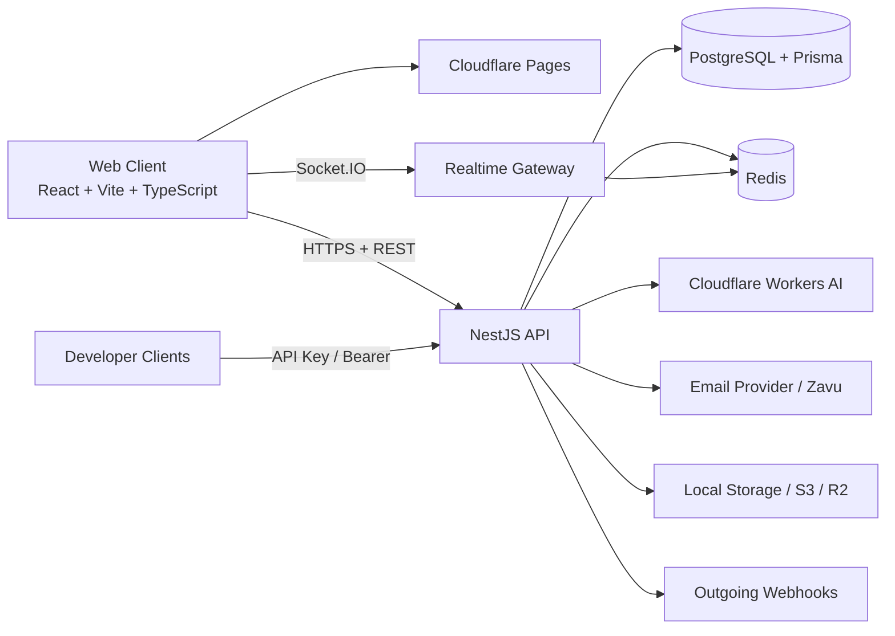

<p align="center">
  
</p>

<h1 align="center">Tasku</h1>

<p align="center">
  Modern Project and Task Management Platform<br />
  Built with React, Vite, NestJS, PostgreSQL, Prisma, Redis, Socket.IO and AI-assisted workflows.
</p>

<p align="center">
  
  
  
  
  
  
  
  
  
  
  
  
  
  
  
  
</p>

## What Is Tasku?

Tasku is a full-stack SaaS platform for project execution. It combines project planning, task orchestration, real-time collaboration, API extensibility, webhook automation, and AI-assisted task generation in a single product.

It is designed for teams that need more than a basic kanban board: engineering squads, operations teams, agencies, and product organizations that want a modern execution layer with API-first integrations and live collaboration.

## Why It Exists

Most task tools split core execution across multiple products: one for boards, another for docs, another for notifications, another for API automation, another for dashboards, and another for AI augmentation.

Tasku brings those concerns together:

- Structured project and task management
- Real-time collaboration and presence
- AI-assisted task creation and refinement
- API keys and webhook automation
- Operational analytics and health visibility
- Bilingual interface with extensible i18n architecture

## Live Demo

| Surface | URL |
| --- | --- |
| Production App | https://tasku.pro/ |
| API Base URL | https://api.tasku.pro |
| Swagger UI | https://api.tasku.pro/api/docs |
| OpenAPI JSON | https://api.tasku.pro/api/docs-json |
| Readme.io Docs | https://tasku.readme.io/ |
| Postman Collection | https://www.postman.com/mundostreaming/tasku/collection/17456888-598fc87b-75b5-49c6-b0b2-a38e06b8a150?action=share&source=copy-link&creator=17456888 |

## Screenshots






## Feature Matrix

### Core Features

| Capability Group | Included |
| --- | --- |
| Project Management | Project creation, ownership transfer, members, invitations, activity history |
| Task Management | Create, edit, delete, assign, filter, prioritize, due dates |
| Subtasks | Inline subtasks, reordering, completion tracking, nested create/update flows |
| Comments | Per-task comment threads with author metadata and soft deletion |
| Attachments | Upload, list, retrieve, and remove entity-linked files |
| Workflow Control | Custom task statuses, board transitions, project lifecycle states |
| Priority System | Low, Medium, High, Critical across UI, API, and analytics |
| Team Collaboration | Shared projects, roles, presence, notifications, activity timeline |

### Views

| View | What It Gives You |
| --- | --- |
| Kanban | Drag-and-drop work management with live status updates |
| List | Dense operational view for filtering, auditing, and bulk review |
| Calendar | Deadline-oriented planning across month, week, and date-based flows |

### Collaboration

| Capability | Implementation |
| --- | --- |
| Real-Time Updates | Socket.IO events with Redis adapter for horizontal-safe broadcasting |
| Presence Indicators | User and project-room presence over WebSockets |
| Activity Timeline | Project and task activity logs persisted in PostgreSQL |
| Notifications | In-app, digest, due-date, and assignment notification flows |

### Authentication

| Capability | Status |
| --- | --- |
| JWT Access Tokens | Implemented |
| Refresh Tokens | Implemented with HTTP-only cookie rotation |
| Email Verification | Implemented |
| Password Recovery | Implemented with one-time hashed reset tokens |
| Google OAuth | Implemented |
| GitHub OAuth | Implemented |
| Provider Architecture | Prepared for Microsoft, Discord, and LinkedIn |

### Developer Platform

| Capability | Implementation |
| --- | --- |
| API Keys | Create, scope, revoke, and audit per user |
| Webhooks | User-configured outgoing webhooks with signing secret |
| Usage Tracking | Summary metrics and recent usage views |
| Developer Portal | Dedicated UI and `/v1/developers/*` endpoints |
| Swagger / OpenAPI | Live Swagger UI and importable OpenAPI JSON |

### AI Features

| Capability | Implementation |
| --- | --- |
| AI Task Generation | Generate full task drafts from a prompt |
| AI Description Improvement | Refine task descriptions with better structure |
| AI Acceptance Criteria | Generated inside structured task payloads |
| AI Subtasks | Generate implementation subtasks |
| AI Priority Suggestions | Infer urgency from task context |
| AI Effort Estimation | Included in AI task generation payloads |

### Internationalization

| Capability | Status |
| --- | --- |
| English | Implemented |
| Spanish | Implemented |
| Locale Configuration | Controlled by `VITE_SUPPORTED_LOCALES` and `VITE_DEFAULT_LOCALE` |
| Extensibility | Translation bundles are lazy-loaded and locale-safe |

## Architecture



## Tech Stack

| Layer | Technology |
| --- | --- |
| Frontend | React 18, Vite 5, TypeScript, React Router, TanStack Query, Zustand, Tailwind CSS, Radix UI, Framer Motion |
| Backend | NestJS 11, TypeScript, class-validator, class-transformer, Passport, JWT |
| Database | PostgreSQL 16, Prisma ORM |
| Realtime | Socket.IO, Redis adapter, project rooms, presence events |
| AI | Cloudflare Workers AI |
| Infrastructure | Docker, Docker Compose, Cloudflare Pages, local or S3/R2 uploads |
| DevOps | GitHub Actions CI, Prisma migrations, deploy shell scripts |
| Documentation | Swagger UI, OpenAPI 3.0 JSON, Readme.io, Postman |

## Project Structure

```text
.
├── apps
│   ├── api
│   │   ├── prisma
│   │   ├── scripts
│   │   ├── src
│   │   └── docker-compose.prod.yml
│   └── web
│       ├── assets
│       ├── scripts
│       └── src
├── docs
│   └── screenshots
├── .github
│   └── workflows
├── docker-compose.dev.yml
├── docker-compose.yml
├── package.json
└── .env.example
```

## Local Development

### Prerequisites

| Requirement | Version |
| --- | --- |
| Node.js | 20.x |
| npm | 10+ |
| PostgreSQL | 16 |
| Redis | 7 |
| Docker | Latest stable |

### Quick Start

```bash
npm install
cp .env.example apps/api/.env
cp apps/web/.env.example apps/web/.env
npm run db:migrate
npm run db:seed
npm run dev
```

Default local URLs:

- Web: http://localhost:3000
- API: http://localhost:3001
- Swagger: http://localhost:3001/api/docs
- OpenAPI JSON: http://localhost:3001/api/docs-json

### Docker Development

```bash
docker compose -f docker-compose.dev.yml up -d
```

Or use the root shortcut:

```bash
npm run docker:dev
```

### Monorepo Scripts

| Command | Purpose |
| --- | --- |
| `npm run dev` | Start API and web together |
| `npm run build` | Build both applications |
| `npm run typecheck` | Typecheck API and web |
| `npm run test` | Run backend tests |
| `npm run db:migrate` | Run Prisma migrations |
| `npm run db:seed` | Seed development data |

## Environment Variables

Tasku uses a root reference example plus app-specific env files.

- Root reference: `.env.example`
- API runtime: `apps/api/.env`
- Web runtime: `apps/web/.env`

### Frontend Variables

| Variable | Required | Purpose |
| --- | --- | --- |
| `VITE_API_URL` | Yes | Base REST API URL used by the web app |
| `VITE_WS_URL` | Yes | WebSocket / Socket.IO base URL |
| `VITE_APP_URL` | Yes | Public frontend URL |
| `VITE_APP_NAME` | No | Display name used by the frontend |
| `VITE_SUPPORTED_LOCALES` | No | Comma-separated locale list, default `en,es` |
| `VITE_DEFAULT_LOCALE` | No | Default locale, default `en` |
| `VITE_GOOGLE_CLIENT_ID` | Optional | Google OAuth client ID for frontend flows |
| `VITE_GITHUB_CLIENT_ID` | Optional | GitHub OAuth client ID for frontend flows |

### Backend Core Variables

| Variable | Required | Purpose |
| --- | --- | --- |
| `NODE_ENV` | Yes | Runtime environment (`development`, `test`, `production`) |
| `DATABASE_URL` | Yes | PostgreSQL connection string |
| `REDIS_URL` | Yes | Redis connection string |
| `REDIS_PREFIX` | No | Redis key namespace prefix |
| `API_PORT` | No | API port, default `3001` |
| `API_PREFIX` | No | Versioned API prefix, default `api/v1` |
| `CORS_ORIGINS` | Yes | Comma-separated CORS allowlist |
| `FRONTEND_URL` | Yes | Frontend origin used in auth and CORS flows |
| `BACKEND_URL` | Recommended | Public backend URL used in deployment docs and integrations |
| `APP_URL` | Recommended | Canonical app URL |
| `OAUTH_REDIRECT_ALLOWLIST` | No | Allowed OAuth redirect targets |
| `COOKIE_DOMAIN` | No | Cookie domain override |
| `COOKIE_SAME_SITE` | No | Cookie same-site policy (`strict`, `lax`, `none`) |

### Authentication and Security Variables

| Variable | Required | Purpose |
| --- | --- | --- |
| `JWT_SECRET` | Production only | Legacy/global JWT secret guardrail |
| `JWT_ACCESS_SECRET` | Yes | Access-token signing secret |
| `JWT_REFRESH_SECRET` | Yes | Refresh-token signing secret |
| `JWT_ACCESS_EXPIRES_IN` | No | Access token TTL |
| `JWT_REFRESH_EXPIRES_IN` | No | Refresh token TTL |
| `THROTTLE_TTL` | No | Throttling window in seconds |
| `THROTTLE_LIMIT` | No | Max requests per throttle window |
| `API_KEY_RATE_LIMIT_PER_HOUR` | No | Machine-to-machine rate limit per API key |

### Cache and Performance Variables

| Variable | Required | Purpose |
| --- | --- | --- |
| `CACHE_TTL_USER` | No | User cache TTL in seconds |
| `CACHE_TTL_PROJECT` | No | Project cache TTL in seconds |
| `CACHE_TTL_TASK` | No | Task cache TTL in seconds |
| `CACHE_TTL_ACTIVITY` | No | Activity cache TTL in seconds |
| `CACHE_TTL_DASHBOARD` | No | Dashboard cache TTL in seconds |

### Email Variables

| Variable | Required | Purpose |
| --- | --- | --- |
| `SEND_REAL_EMAIL` | No | Toggle real delivery vs preview mode |
| `ZAVU_API_KEY` | Production only | Email provider API key |
| `ZAVU_SENDER_ID` | Required when `SEND_REAL_EMAIL=true` | Sender identity |
| `ZAVU_TEMPLATE_RESET_PASSWORD` | Optional | Default reset-password template |
| `ZAVU_TEMPLATE_RESET_PASSWORD_ES` | Optional | Spanish reset-password template |
| `ZAVU_TEMPLATE_RESET_PASSWORD_EN` | Optional | English reset-password template |
| `ZAVU_TEMPLATE_WELCOME` | Optional | Default welcome template |
| `ZAVU_TEMPLATE_WELCOME_ES` | Optional | Spanish welcome template |
| `ZAVU_TEMPLATE_WELCOME_EN` | Optional | English welcome template |
| `ZAVU_TEMPLATE_PROJECT_INVITATION` | Optional | Default project invitation template |
| `ZAVU_TEMPLATE_PROJECT_INVITATION_ES` | Optional | Spanish invitation template |
| `ZAVU_TEMPLATE_PROJECT_INVITATION_EN` | Optional | English invitation template |
| `ZAVU_TEMPLATE_TASK_ASSIGNED` | Optional | Default assignment template |
| `ZAVU_TEMPLATE_TASK_ASSIGNED_ES` | Optional | Spanish assignment template |
| `ZAVU_TEMPLATE_TASK_ASSIGNED_EN` | Optional | English assignment template |
| `ZAVU_TEMPLATE_TASK_DUE_REMINDER` | Optional | Default due reminder template |
| `ZAVU_TEMPLATE_TASK_DUE_REMINDER_ES` | Optional | Spanish due reminder template |
| `ZAVU_TEMPLATE_TASK_DUE_REMINDER_EN` | Optional | English due reminder template |
| `ZAVU_TEMPLATE_WEEKLY_DIGEST` | Optional | Default weekly digest template |
| `ZAVU_TEMPLATE_WEEKLY_DIGEST_ES` | Optional | Spanish weekly digest template |
| `ZAVU_TEMPLATE_WEEKLY_DIGEST_EN` | Optional | English weekly digest template |

### OAuth Variables

| Variable | Required | Purpose |
| --- | --- | --- |
| `GOOGLE_CLIENT_ID` | Optional | Google OAuth client ID |
| `GOOGLE_CLIENT_SECRET` | Optional | Google OAuth secret |
| `GITHUB_CLIENT_ID` | Optional | GitHub OAuth client ID |
| `GITHUB_CLIENT_SECRET` | Optional | GitHub OAuth secret |
| `MICROSOFT_CLIENT_ID` | Optional | Reserved provider support |
| `MICROSOFT_CLIENT_SECRET` | Optional | Reserved provider support |
| `DISCORD_CLIENT_ID` | Optional | Reserved provider support |
| `DISCORD_CLIENT_SECRET` | Optional | Reserved provider support |
| `LINKEDIN_CLIENT_ID` | Optional | Reserved provider support |
| `LINKEDIN_CLIENT_SECRET` | Optional | Reserved provider support |

### AI Variables

| Variable | Required | Purpose |
| --- | --- | --- |
| `CLOUDFLARE_ACCOUNT_ID` | Optional | Cloudflare account used for Workers AI |
| `CLOUDFLARE_API_TOKEN` | Optional | Cloudflare API token |
| `CLOUDFLARE_AI_MODEL` | Optional | Model identifier for AI generation |
| `AI_REQUEST_TIMEOUT_MS` | Optional | AI request timeout |
| `AI_REQUEST_RETRIES` | Optional | Retry attempts for AI calls |
| `AI_CACHE_TTL_MS` | Optional | AI response cache window |

### Upload Variables

| Variable | Required | Purpose |
| --- | --- | --- |
| `UPLOADS_PROVIDER` | No | `local`, `s3`, or `r2` |
| `UPLOADS_LOCAL_ROOT` | No | Local storage path |
| `UPLOADS_MAX_FILE_SIZE_MB` | No | Upload file-size cap |
| `UPLOADS_ANTIVIRUS_ENABLED` | No | Toggle antivirus pipeline |
| `UPLOADS_SIGNING_SECRET` | Yes | Signing secret for upload-related trust checks |
| `UPLOADS_S3_BUCKET` | Optional | Bucket name for S3 or R2 |
| `UPLOADS_S3_REGION` | Optional | S3 or R2 region |
| `UPLOADS_S3_ENDPOINT` | Optional | Custom S3-compatible endpoint |
| `UPLOADS_S3_ACCESS_KEY` | Optional | Access key |
| `UPLOADS_S3_SECRET_KEY` | Optional | Secret key |
| `UPLOADS_S3_PUBLIC_BASE_URL` | Optional | Public CDN or bucket base URL |
| `UPLOADS_S3_FORCE_PATH_STYLE` | Optional | Path-style toggle for compatible providers |

### Docker and Infra Variables

| Variable | Required | Purpose |
| --- | --- | --- |
| `POSTGRES_USER` | Docker only | PostgreSQL username |
| `POSTGRES_PASSWORD` | Docker only | PostgreSQL password |
| `POSTGRES_DB` | Docker only | PostgreSQL database name |
| `REDIS_PASSWORD` | Production docker | Redis password used by `apps/api/docker-compose.prod.yml` |
| `API_ENV_FILE` | Deploy script only | Env file path consumed by API deploy script |
| `CLOUDFLARE_PAGES_PROJECT` | Web deploy only | Cloudflare Pages project name |

## Docker

### Root Development Stack

The root `docker-compose.dev.yml` boots:

- PostgreSQL 16
- Redis 7
- NestJS API
- Web frontend container

### Root Production-Like Stack

The root `docker-compose.yml` provides a full local stack with health checks for:

- `postgres`
- `redis`
- `api`
- `web`

### API Production Stack

The file `apps/api/docker-compose.prod.yml` is tuned for backend deployment and adds:

- persistent uploads volume
- Redis password support
- API health checks against the versioned health route

## Deploy with PM2

PM2 is the official non-Docker production mode for traditional Linux servers such as Ubuntu, Debian, VPS, DigitalOcean, AWS EC2, Hetzner, and Contabo.

### Instalación

```bash
cd apps/api
npm install
```

PM2 is installed as a runtime dependency together with `pm2-runtime`.

### Build

```bash
npm run build
```

The production bundle runs from `dist/main.js`.

### Start

```bash
npm run pm2:start
```

This loads `ecosystem.config.js`, reads `.env.production` first and then `.env`, and starts the API in PM2 cluster mode by default.

### Restart

```bash
npm run pm2:restart
```

### Logs

```bash
npm run pm2:logs
```

PM2 writes logs to `logs/out.log` and `logs/error.log`.

For log rotation on Linux hosts:

```bash
pm2 install pm2-logrotate
```

### Startup

```bash
pm2 startup
pm2 save
```

Run those commands after the process is registered so PM2 restores it on reboot.

### Zero Downtime Reload

```bash
pm2 reload gopass-api --update-env
```

If the deployment uses WebSockets and the infrastructure does not provide sticky sessions, set `PM2_INSTANCES=1` before starting PM2. The default remains `instances: "max"` with `exec_mode: "cluster"` for standard horizontal scaling.

## Deployment

### Frontend: Cloudflare Pages

Tasku web is deployed from `apps/web` using Wrangler.

```bash
cd apps/web
npm run deploy
```

Expected environment:

- `CLOUDFLARE_ACCOUNT_ID`
- `CLOUDFLARE_PAGES_PROJECT`
- `VITE_API_URL`
- `VITE_WS_URL`
- `VITE_APP_URL`
- `VITE_SUPPORTED_LOCALES`

### Backend: Docker + PostgreSQL + Redis

Tasku API is deployed from `apps/api` using Docker Compose and migration automation.

```bash
cd apps/api
npm run deploy
```

The deploy script:

1. Validates required env vars.
2. Builds and starts the production compose stack.
3. Runs `prisma migrate deploy`.
4. Waits for the API health endpoint to become healthy.

## API Documentation

| Resource | URL |
| --- | --- |
| Swagger UI | https://api.tasku.pro/api/docs |
| OpenAPI JSON | https://api.tasku.pro/api/docs-json |
| Readme.io | https://tasku.readme.io/ |
| Local Swagger UI | http://localhost:3001/api/docs |
| Local OpenAPI JSON | http://localhost:3001/api/docs-json |

OpenAPI notes:

- OpenAPI version: 3.0.0
- Generated directly from NestJS Swagger decorators
- Validated for import into Postman, Readme.io, Insomnia, Bruno, and Hoppscotch
- Enriched with request examples, server entries, and response descriptions

## Postman

### Import the public collection

Use the shared collection link:

https://www.postman.com/mundostreaming/tasku/collection/17456888-598fc87b-75b5-49c6-b0b2-a38e06b8a150?action=share&source=copy-link&creator=17456888

### Import the live OpenAPI document

You can also import the generated OpenAPI directly from:

```text
https://api.tasku.pro/api/docs-json
```

## Authentication

### Supported Modes

| Mode | How It Works |
| --- | --- |
| JWT Bearer | Use `Authorization: Bearer <access_token>` |
| Refresh Cookie | HTTP-only cookie rotation for session renewal |
| API Key | Use `X-API-Key: <tasku_key>` |
| OAuth | Google and GitHub login flows |

### Auth Flows

- Register: `POST /v1/auth/register`
- Login: `POST /v1/auth/login`
- OAuth login: `POST /v1/auth/oauth/{provider}`
- Refresh: `POST /v1/auth/refresh`
- Logout: `POST /v1/auth/logout`
- Password recovery: `POST /v1/auth/forgot-password` and `POST /v1/auth/reset-password`
- Email verification: `GET /v1/auth/verify-email`

## API Keys

Tasku includes a developer portal and API key lifecycle.

### Key Management

- Create via `POST /v1/developers/keys`
- List via `GET /v1/developers/keys`
- Revoke via `DELETE /v1/developers/keys/{id}`

### Scopes

Typical scopes include combinations like:

- `projects:read`
- `tasks:write`
- `webhooks:read`
- `webhooks:write`

### Usage and Limits

- Summary: `GET /v1/developers/usage/summary`
- Recent requests: `GET /v1/developers/usage/requests`
- Limits: `GET /v1/developers/limits`

API keys are intended for machine-to-machine use and are rate-limited separately.

## Webhooks

Tasku can emit signed outgoing webhooks for subscribed task events.

### Webhook Management

- List hooks: `GET /v1/developers/webhooks`
- Create hook: `POST /v1/developers/webhooks`
- Disable hook: `DELETE /v1/developers/webhooks/{id}`
- Delivery history: `GET /v1/developers/webhooks/deliveries`

### Delivery Headers

| Header | Meaning |
| --- | --- |
| `X-Tasku-Delivery` | Delivery identifier |
| `X-Tasku-Event` | Event name |
| `X-Tasku-Timestamp` | Attempt timestamp in ISO format |
| `X-Tasku-Signature` | HMAC SHA-256 signature of the JSON payload |
| `User-Agent` | `Tasku-Webhooks/1.0` |

### Signature

Tasku signs the raw JSON payload using HMAC SHA-256 and the webhook secret.

### Payload Shape

```json
{
  "id": "delivery-event-id",
  "event": "task.created",
  "occurredAt": "2026-06-01T12:00:00.000Z",
  "data": {
    "taskId": "task-id",
    "projectId": "project-id"
  }
}
```

### Retries

Webhook retries are scheduled with progressive delays of:

- 1 minute
- 5 minutes
- 15 minutes

Tasku persists response code, response body, duration, retry count, and next retry time for auditability.

## Internationalization

Tasku currently ships with:

- English
- Spanish

### Add a New Locale

1. Add the locale code to `VITE_SUPPORTED_LOCALES`.
2. Set `VITE_DEFAULT_LOCALE` if it should be the new default.
3. Add translation files under `apps/web/src/i18n/locales/`.
4. Ensure labels are registered in the locale helper.
5. Validate the language switcher across guest and authenticated shells.

## AI

Tasku uses Cloudflare Workers AI for structured task assistance.

### Current AI Endpoints

- `POST /v1/ai/tasks/generate`
- `POST /v1/ai/tasks/improve-description`
- `POST /v1/ai/tasks/subtasks`
- `POST /v1/ai/tasks/priority`
- `POST /v1/ai/tasks/suggestions`
- `POST /v1/ai/tasks/regenerate-sections`
- `POST /v1/ai/tasks/confirm`

### AI Use Cases

- Generate complete task drafts from a prompt
- Improve technical task descriptions
- Produce structured subtasks
- Suggest priority and estimated effort
- Regenerate sections without discarding the whole draft

## Performance

| Area | Strategy |
| --- | --- |
| Redis Cache | Cached user, project, task, activity, and dashboard views |
| Realtime | Socket.IO + Redis adapter for scalable event fan-out |
| Database | Prisma with indexed relational models, filtering, and pagination |
| API | Global validation, transform interceptors, and throttling |
| Frontend | Vite build pipeline, route-based rendering, query caching |

## Security

| Area | Implementation |
| --- | --- |
| JWT | Separate access and refresh secrets |
| Refresh Tokens | HTTP-only cookie rotation and revocation |
| Permissions | User roles and project-level RBAC |
| Rate Limits | Global throttling plus API-key limits |
| Webhook Signatures | HMAC SHA-256 signing with per-hook secret |
| API Keys | Scoped access and revoke lifecycle |
| Password Reset | One-time hashed reset tokens |
| Headers | Helmet, CSP, HSTS, frameguard, no-sniff |

## Testing and QA

| Surface | Command |
| --- | --- |
| API tests | `npm run test -w apps/api` |
| API typecheck | `npm run typecheck -w apps/api` |
| Web typecheck | `npm run typecheck -w apps/web` |
| Full build | `npm run build` |
| Swagger validation | Import `http://localhost:3001/api/docs-json` or `https://api.tasku.pro/api/docs-json` |

CI exists in `.github/workflows/ci.yml` and covers lint, typecheck, API tests, web build, and Docker image builds.

## Roadmap

- Advanced analytics and executive reporting
- Mobile application clients
- AI sprint planning and backlog clustering
- Gantt and timeline planning view
- Expanded audit log exploration
- More OAuth providers and enterprise SSO

## Contributing

This repository is currently maintained as a private/proprietary product codebase.

If you are collaborating internally:

1. Create a feature branch from `main`.
2. Keep changes scoped to one concern per branch.
3. Run typecheck, build, and relevant tests before opening a review.
4. Update OpenAPI-facing decorators when changing request or response shapes.
5. Keep the README, docs links, and env tables aligned with runtime changes.

## License

Tasku is distributed under a proprietary license. See [LICENSE](LICENSE).
